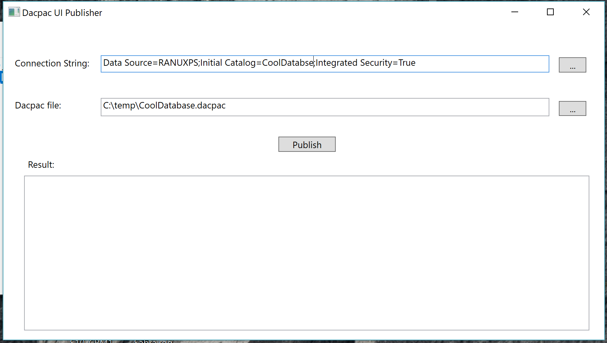

# DacpacPublisher

DacpacPublisher is as UI tool to deploy/publish Dacpac files on MS Sql database. This tool is just to do more user friendly the deploy of a dacpac.

## Download

The release includes a standalone EXE to make it really easy. But it needs .Net Framework 4.7 installed.

[Download](https://github.com/elranu/DacpacPublisher/releases/download/1.0.0/SqlDacUIPublisher.exe)

## Contributing

If you wanna contribute just send the PR. The code is really easy